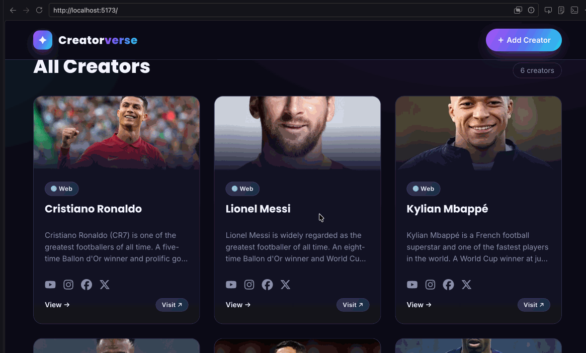

# Creatorverse

Submitted by: **pjasmat**

Creatorverse is a full-CRUD React app for sharing your favorite content creators. Browse a gallery of creators, view their details, visit their channels, and add, edit, or delete creators. Data is persisted in a Supabase (Postgres) database.

Time spent: **X** hours spent in total

## Required Features

The following **required** functionality is completed:

- [x] **A logical component structure in React is used to create the frontend of the app**
- [x] **At least five content creators are displayed on the homepage of the app**
- [x] **Each content creator item includes their name, a link to their channel/page, and a short description of their content**
- [x] **API calls use the async/await design pattern via Axios or fetch**
- [x] **Clicking on a content creator item takes the user to their details page, which includes their name, url, and description**
- [x] **Each content creator has their own unique URL**
- [x] **The user can edit a content creator to change their name, url, or description**
- [x] **The user can delete a content creator**
- [x] **The user can add a new content creator by entering a name, url, and description**

## Stretch Features

The following **stretch** features are implemented:

- [ ] Picocss is used to style HTML elements (custom CSS is used instead)
- [x] The content creator items are displayed in a creative format, like cards instead of a list
- [x] An image of each content creator is shown on their content creator card

## Video Walkthrough

Here's a walkthrough of implemented features:

## Notes

Describe any challenges encountered while building the app here.

## License

    Copyright [2026] [pjasmat]

    Licensed under the Apache License, Version 2.0 (the "License");
    you may not use this file except in compliance with the License.
    You may obtain a copy of the License at

        http://www.apache.org/licenses/LICENSE-2.0

    Unless required by applicable law or agreed to in writing, software
    distributed under the License is distributed on an "AS IS" BASIS,
    WITHOUT WARRANTIES OR CONDITIONS OF ANY KIND, either express or implied.
    See the License for the specific language governing permissions and
    limitations under the License.
